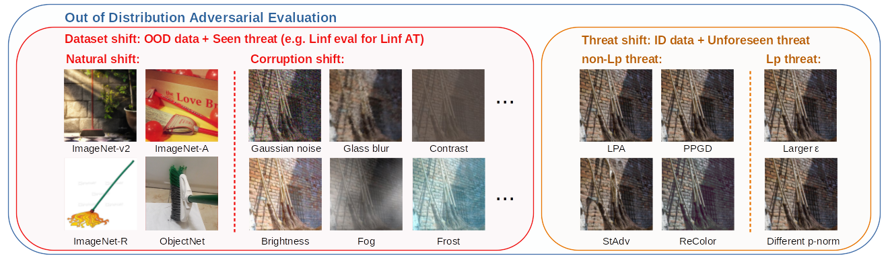

# OODRobustBench: Adversarial Robustness under Distribution Shift
**Lin Li (KCL), Yifei Wang (MIT), Chawin Sitawarin (UC Berkeley), Michael Spratling (KCL)**

This is the official code of the paper "OODRobustBench: a benchmark and large-scale analysis of adversarial robustness under distribution shift". This work has been accepted by the main conference of ICML 2024 and the workshop Data-centric Machine Learning Research (DMLR) of ICLR 2024.

The leaderboard: https://oodrobustbench.github.io/

Paper: https://arxiv.org/abs/2310.12793

## High-level idea and design

Existing works have made great progress in improving adversarial robustness, but typically test their method only on data from the same distribution as the training data, i.e. in-distribution (ID) testing. As a result, it is unclear how such robustness generalizes under input distribution shifts, i.e. out-of-distribution (OOD) testing. This is a concerning omission as such distribution shifts are unavoidable when methods are deployed in the wild. To address this issue we propose a benchmark named OODRobustBench to comprehensively assess OOD adversarial robustness using 23 dataset-wise shifts (i.e. naturalistic shifts in input distribution) and 6 threat-wise shifts (i.e., unforeseen adversarial threat models).



The code of OODRobustBench is built on top of [RobustBench](https://github.com/RobustBench/robustbench) to allow a unified, RobustBench-like, interface of evaluation and loading models and support loading (latest) models from RobustBench, in other words, you know how to use RobustBench then you know how to use OODRobustBench. Nevertheless, if you have not used RobustBench before, no worry! We have provided a detailed and easy-to-follow guide below for preparation and usage. 

## Preparation

### Dependencies

```bash
pip install -r requirements.txt
```

### Data

We suggest to put all datasets under the same directory (say $DATA) to ease data management and avoid modifying the source code of data loading. An overview of the file structure is shown below

```bash
$DATA/
|–– cifar-10-batches-py/
|–– cifar-10.1/
|–– cifar-10.2/
|–– cifar-10-r/
|–– CIFAR-10-C/
|–– CINIC-10/
|–– imagenet/
|–– imagenetv2-matched-frequency-format-val/
|–– imagenet-a/
|–– imagenet-r/
|–– objectnet/
|–– ImageNet-C/
```

The above datasets are divided into two groups:

1. Automatic download: CIFAR10, CIFAR10-C
2. Manual download: [CIFAR10.1](https://github.com/modestyachts/CIFAR-10.1/tree/master/datasets), [CIFAR10.2](https://github.com/modestyachts/cifar-10.2), [CIFAR10-R](https://github.com/TreeLLi/cifar10-r), [CINIC-10](https://datashare.ed.ac.uk/handle/10283/3192), [ImageNet](https://image-net.org/download.php), [ImageNet-v2](https://huggingface.co/datasets/vaishaal/ImageNetV2/tree/main), [ImageNet-A](https://people.eecs.berkeley.edu/~hendrycks/imagenet-a.tar), [ImageNet-R](https://people.eecs.berkeley.edu/~hendrycks/imagenet-r.tar), [ImageNet-C](https://github.com/hendrycks/robustness#imagenet-c), [ObjectNet](https://www.kaggle.com/datasets/treelinli/objectnet-imagenet-overlap)

Datasets in Group 1 will be downloaded automatically when used. Datasets in Group 2 need to be downloaded from the given links by clicking the dataset name and structured as specified above. A guide on how to prepare ImageNet can be found [here](https://github.com/soumith/imagenet-multiGPU.torch#data-processing).

Note that the folder names should be followed strictly unless modifying our original source code. We suggest to use [soft link](https://en.wikipedia.org/wiki/Symbolic_link) to reuse the datasets that you have already had before by linking them to $DATA. 

## Model Zoo

Our model zoo consists of two groups: ones are loaded by RobustBench API and the others are manually collected from public adversarial ML works (not covered by RobustBench at least by the release time of this work). Therefore, **OODRobustBench should be able to support the seamless loading of future submissions to RobustBench by simply upgrading the version of RobustBench in the dependency.** 

TODO: host all other models in the same source or list their origins

### Automatic loading and manual download


#### Add your model to the model zoo

1. Put your model checkpoint file under the appropriate directory
2. (Optional) add your custom model architecture file under `/oodrb/models`
3. Modify `/oodrb/models/__init__.py` to add a callable constructor of your model arch
4. Modify `load_model()` in `/oodrb/utils.py` to load trained weights to your model


lambda, model, prepr, normalize


### Contribution: Submit your model to the model zoo and leaderboard

Below summarize the steps to submit your model to the leaderboad:

1. Open a pull

To submit your model to the leaderboard, you need to first integrate your model into the model zoo by modifying the source code.


## Evaluation

We describe below the template commands we used to get the results reported in our paper. The output results are saved under the directory `model_info/$DATASET/$THREAT_MODEL`. The program automatically saves the result of each shift evaluation and load the results from the saved file if have so no need to worry about the evaluation being interrupted.

### Dataset shift

For CIFAR10 $\ell_\infty$ models under all corruptions and natural shifts with 10k samples:

```bash
python oodrb/eval.py --data_dir $DATA --threat-model Linf --adv-norm Linf -a mm5 --corruption-models corruptions --natural-shifts all -n 10000 --model_name $MODEL_NAME
```

Please refer to the code of `oodrb/eval.py` or running the command `python oodrb/eval.py -h` for the explanation and the candidate values of each argument. 

For CIFAR10 $\ell_2$ models:

```bash
python oodrb/eval.py --data_dir $DATA --threat-model L2 --adv-norm L2 -a mm5 --corruption-models corruptions --natural-shifts all -n 10000 --model_name $MODEL_NAME
```

For ImageNet $\ell_\infty$ models:

```bash
python oodrb/eval.py --data_dir $DATA --dataset imagenet --threat-model Linf --adv-norm Linf -a mm5 --eps 0.01568627 --corruption-models corruptions --natural-shifts all -n 5000 --model_name $MODEL_NAME
```

### Threat shift

For CIFAR10 $\ell_\infty$ models against LPA threat shift:

```bash
python oodrb/eval.py --data_dir $DATA --threat-model Linf -a lpa --eps 0.5 -n 10000 --model_name $MODEL_NAME
```

For CIFAR10 $\ell_\infty$ models against PPGD threat shift:

```bash
python oodrb/eval.py --data_dir $DATA --threat-model Linf -a ppgd --eps 0.5 -n 10000 --model_name $MODEL_NAME
```

For CIFAR10 $\ell_\infty$ models against ReColor threat shift:

```bash
python oodrb/eval.py --data_dir $DATA --threat-model Linf -a stadv --eps 0.05 -n 10000 --model_name $MODEL_NAME
```

For CIFAR10 $\ell_\infty$ models against StAdv threat shift:

```bash
python oodrb/eval.py --data_dir $DATA --threat-model Linf -a recolor --eps 0.06 -n 10000 --model_name $MODEL_NAME
```

For CIFAR10 $\ell_\infty$ models against different $p$-norm threat shift:

```bash
python oodrb/eval.py --data_dir $DATA --threat-model Linf --adv-norm L2 -a mm5 --eps 0.5 -n 10000 --model_name $MODEL_NAME
```

For CIFAR10 $\ell_\infty$ models against different $\epsilon$ threat shift:

```bash
python oodrb/eval.py --data_dir $DATA --threat-model Linf --adv-norm Linf -a mm5 --eps 0.0470588 -n 10000 --model_name $MODEL_NAME
```

Please refer to our paper for the configuration of threat shifts for the settings other than CIFAR10 $\ell_\infty$.

### Evaluate your own model

To evaluate your own models, there are three options.

#### Calling benchmark()

The first solution is to use the low-level API `benchmark()` provided in `oodrb/eval.py` as exemplified below:

```python
from oodrb.eval import benchmark
model = TODO
model.eval()
id_acc, id_rob, ood_acc_robs = benchmark(model,
                                         n_examples=10000,
                                         dataset='cifar10',
                                         attack='mm5',
                                         threat_model='Linf',
                                         adv_norm='Linf',
                                         natural_shifts='all',
                                         corruption_models='corruptions',
                                         corruptions=None,
                                         severities=[1,2,3,4,5],
                                         to_disk=True,
                                         model_name=$MODEL_NAME,
                                         data_dir=$DATA,
                                         device='cuda',
                                         batch_size=100,
                                         eps=8/255)
```

This is exactly what happens when you run the script of `python oodrb/eval.py`. Note that the results will be also saved on the disk when calling `benchmark()` to evaluate.

#### Modifying the source code to support loading your model

submit the model or modify the source code

#### Submit your model to RobustBench and upgrade the dependency of this program

submit to RobustBench

## Chawin's Custom Models

Model name is a bit long and starts with `custom_`. It contains the hyperparameter choices. For example, `custom_convmixer_trades_trades_seed0_bs512_lr0.1_wd0.0001_sgd_50ep_eps0.5_beta0.1`,

The weights are hosted on Zenodo and is downloaded automatically when a model is called. Download speed from Zenodo server can be poor sometimes so if you know you want to use all the models, you can download all the weights at once with `zenodo_get` and put them at the right location:

```bash
pip install zenodo_get
cd $MODEL_PATH  # mkdir if needed
zenodo_get $DEPOSIT_ID
```

where `$DEPOSIT_ID` and `$MODEL_PATH` are the Zenodo deposit ID and the associated model path. Each deposit has a maximum size of 40 GB and contains a group of models denoted by the path. See the list of `$DEPOSIT_ID: $MODEL_PATH` below:

* `8285099`: `cifar10/L2`.

Please install the extra packages in `requirements.txt`. See `oodar.models.custom_models.utils._MODEL_DATA` for the list of available models.

## Citation

```
@inproceedings{li2024oodrobustbench,
    title={OODRobustBench: a benchmark and large-scale analysis of adversarial robustness under distribution shift},
    author={Lin Li, Yifei Wang, Chawin Sitawarin, Michael Spratling},
    booktitle={International Conference on Machine Learning},
    year={2024}
}
```
